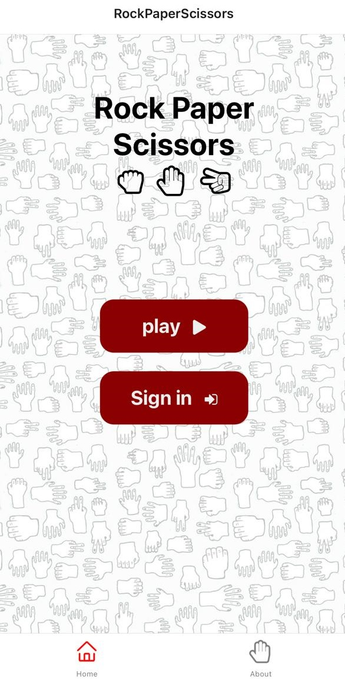
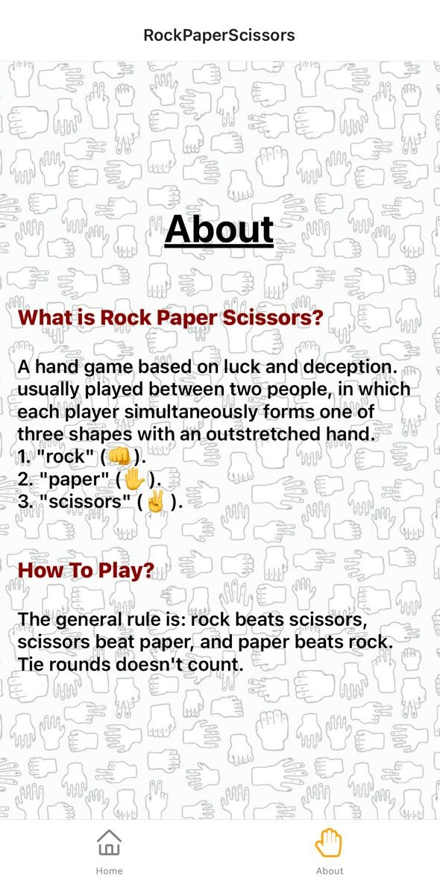
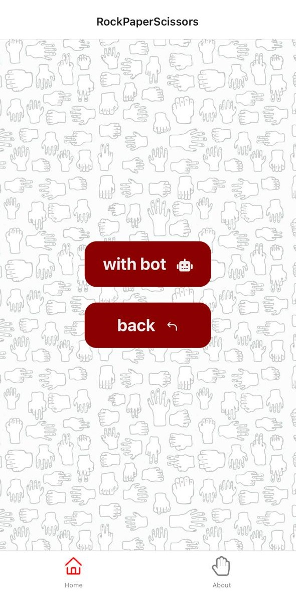
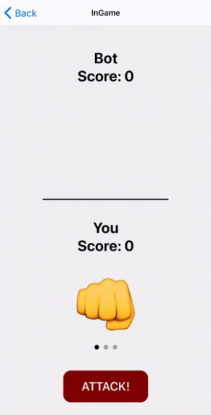
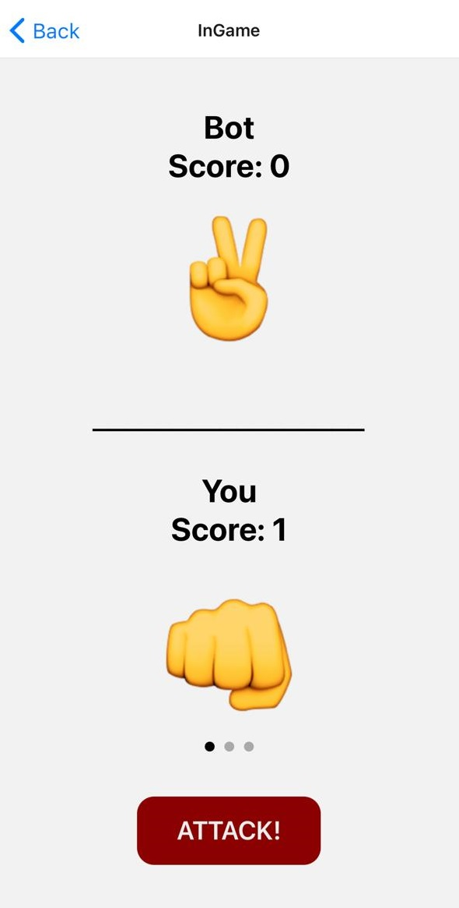

# RockPaperScissors Game

## Overview

the classic game of rock paper scissors made into native app, available on IOS and Android

### Authors

Afnan Damra - Ahmad Alfrijat - Zaid Alasfar

### Demo

#### Pages: 
1. **Home:**

the game starting point, note that the sign in option isn't available yet, wait for it in version 2 :)



2. **About:**

a small introduction to the game and its rules for beginners



3. **Play mode:**

to choose who will be your opponent, a bot or another signed in player (you guessed it! version 2)



4. **InGame:**

Finally! you are given the famos three options to choose from, after you choose just press attack and see what your opponent chose, keep track of your score, and GOOD LUCK :tada:

  1. choose your move:
    
  

  2. keep track of your score, you won this round :smiley:
  
  

### Architecture

- Built with react native, nodejs
- used `expo-cli` to view and test the application

### Cloning

if you want to clone the project make sure to follow these steps:

1. clone the project:

```bash
$ git clone https://github.com/svanlaug/rock-paper-scissors.git
```

2. navigate to the project directory.

3. install required dependencies:

```bash
$ npm install
```

4. it's optional but highly recommended to have `expo-cli` installed globally to view the application.

5. to view/run the application:

```bash
$ expo start
```

6. scan the QR code on your phone, and enjoy! :tada:
